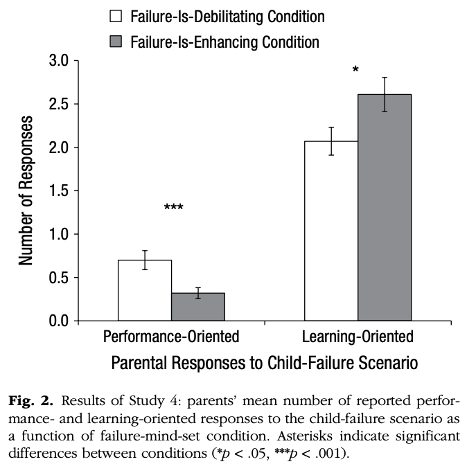

<!-- Replication reports should all use this template to standardize reporting across projects.  These reports will be public supplementary materials that accompany the summary report(s) of the aggregate results. -->

## Introduction

### Overview of Original Study
Through a series of four experiments, Haimovitz and Dweck (2016) found that parents' views of failure predicted their children's views of intelligence; that is, parents who viewed failure as debilitating (rather than enhancing) were more likely to have children who believed that their intelligence is fixed (rather than malleable). Furthermore, parents' views of failure impacted the way that parents viewed their own children's failure; parents who believed that failure is debilitating focused on their children's performance and ability, instead of their learning. This study suggested that parents' views of failure are displayed to children in tangible ways through specific parenting practices (e.g., being concerned about their children's performance when they fail), which then impact children's own views of intelligence.

### Project Goals and Procedures
This project aimed to replicate the results reported in Experiment 4, which found a causal relationship between parents' views of failure and their response to a hypothetical scenario in which their child came home with a failing grade. Just like the original study, this replication study was also conducted online. Parents' views of failure, as well as other information, was collected using an online Qualtrics survey. A biased, 5-item survey was included to manipulate participants' views of failure, followed by an open-ended question that asked participants how they would react to the hypothetical scenario. Participants were parents with children of all ages, and they were recruited through an online recruitment platform called Prolific.

### Anticipated Challenges
Some parts of the methods outlined in the original paper were open to interpretation, and I relied on being able to reach out to the authors for some clarification. I also anticipated having to spend extra time figuring out how to randomly assign participants to one of two conditions in Qualtrics. Furthermore, the open-ended responses needed to be coded by two raters to assess reliability, so I considered seeking an undergraduate RA or another PYSCH 251 student to help me code these responses. Finally, I anticipated having to spend extra time conducting the statistical analyses, given my limited training in statistics.

### Project Justification
This project aligned with my broader interests in reading mindset interventions. I'm particularly interested in the role that parents and teachers play in fostering children's mindset and reading development. I thought parents would be especially interesting to study at this time, given that children were more likely to be spending time at home with their parents during the COVID-19 pandemic. In a recent independent project, I found that parents' views of failure were related to their children's reading abilities. This project will allow me to start thinking more deeply about *how* these parental views could possibly cause children to think and perform in a certain way.

### Links

* The original paper by Haimovitz and Dweck (2016) can be accessed through https://github.com/psych251/haimovitz2016_2/blob/main/original_paper/haimovitz2016_paper.pdf
* The Github repository for this project can be accessed through https://github.com/psych251/haimovitz2016_2

## Methods

### Power Analysis

Original effect size, power analysis for samples to achieve 80%, 90%, 95% power to detect that effect size.  Considerations of feasibility for selecting planned sample size. 

(Attempted power analysis using G*Power but will complete this section after clarifying some confusions during office hours.)

### Planned Sample

X parents were recruited to achieve Y% power and to account for some participants whose data may not be usable. Parents were recruited through a crowdsourcing platform called Prolific. The participant pool on Prolific was filtered by parental status to specifically reach parents.

In the original study, 310 adults from a crowdsourcing platform called Amazon Mechanical Turk completed an initial survey asking whether they were a parent. Out of these adults, 132 of them reported to be a parent and were chosen to participate in the study. The sample also had the following demographics: 

* "57% female" 
* "31% had a high school diploma or some college education, 51% had a college degree, and 18% had a postgraduate degree." 
* "75% White, 12% African American, 7% Asian American, and 6% Hispanic"

### Materials and Procedure

#### General Materials and Procedures

The replication study followed the materials and procedures outlined in the original article: 

>"Participants completed an online survey initially assessing several beliefs, including their perceptions of their child’s competence (assessed with same measure as in Study 1; α = .79). Then we temporarily manipulated failure mind-sets by randomly assigning the parents to complete one of two five-item biased questionnaires, written to foster agreement with either a failure-is-debilitating mind-set (e.g., “Experiencing failure can lead to negative feelings, like shame or sadness, that interfere with learning”) or a failure-is-enhancing mind-set (e.g., “Experiencing failure can improve performance in the long run if you learn from it”). All measures used a 6-point rating scale from 1 (strongly disagree) to 6 (strongly agree). ...

>We then asked participants to read and vividly imagine a scenario in which their child came home from school with a failing grade on a math quiz, as in Study 2. They then wrote what they would do, think, and feel in response. Finally, participants reported on their failure mind-sets (α = .82), using the same items as in Study 1, as part of a survey that included a few other items."

Additionally, all survey items included in the supplementary ["Materials and Methods" document](https://github.com/psych251/haimovitz2016_2/blob/main/original_paper/haimovitz2016_materials_measures.pdf) were used. 

From reading the original article and supplementary document, it was not clear whether the middle points on the Likert scale were labelled. Based on similar studies examining intelligence mindsets, I decided to label the middle points with "mostly dis/agree" and "slightly dis/agree." It was also unclear what "other items" were included in the final survey asking participants to report on their failure mindsets. These "other items" were not needed to replicate the main results, so they were omitted from this replication study. As I was also not sure where to collect demographic data (i.e., sex, race, education level, child's age), I decided to collect this information as part of the final survey at the very end of the study.

Here is a link to the survey that was used to conduct the replication study: 
https://stanforduniversity.qualtrics.com/jfe/form/SV_9yLXExjnUOE8XzM

#### Data Processing/Coding

The following procedures from the original article outlined how the open-ended responses were coded. These procedures, in addition to guidelines outlined in the supplementary ["Materials and Methods" document](https://github.com/psych251/haimovitz2016_2/blob/main/original_paper/haimovitz2016_materials_measures.pdf) were carefully followed except for a few exceptions explained below. 

> "Two raters, blind to condition, coded the open-ended responses. The first author developed a coding scheme on the basis of an initial reading of the responses and then made clarifying revisions on the basis of feedback from the two raters.

> The codes were broken down into two main categories of interest: performance-oriented responses and learning-oriented responses. Coders gave a score of 1 each time a code was present. Codes in the performance-oriented category were responses that focused on judgments of ability, particularly as a stable trait (e.g., “I would think maybe my child is just not that good at math”); comfort for lack of ability (e.g., “It’s ok that you got an F. You tried your best”); contingent self-worth based on their child’s performance (e.g., “I’d feel bad about myself”); pity for their child’s lack of ability (“I would feel a little nervous for my child because I know how hard it can be”); grades as a goal (e.g., “I would . . . hope their grades from previous [tests] are high enough to make up for the test”); and social comparison (“I would also want to know how the other children in the class scored”). Codes in the learning-oriented category were responses that focused on judgments of effort (e.g., “I would tell my son he needs to study harder”); strategies, which included both general strategies (e.g., “he didn’t study the material in the right way”) and specific study or test-taking strategies (e.g., “I would also say that double checking your work before you hand it in is a good habit to get into”); help seeking (e.g., “I would get her a math tutor”); mastery, or conceptual understanding, as a goal (e.g., “the important thing we need to do is try to understand the concepts behind the problems he got wrong, and then study those”); interest (e.g., “I would hope that the results of the test would not stop her from enjoying the class and wonder about ways I could help keep her liking of the subject going”); and explicit characterizations of failure as enhancing, or good (e.g., “It is ok to make mistakes and fail sometimes, because that’s how people learn”).

> Two statements that repeated the same sentiment were not coded as two instances (e.g., “I would question how much studying did they do” and “I would also ask . . . do they think they studied enough” would be one code for effort). However, two statements that expressed different ideas but fell under the same code were marked as two instances (e.g., “I would question my child to make sure that she studied the correct material thoroughly” and “I would ask to make sure that she was paying attention in class” would be marked as two codes for strategies, as these statements represent different strategies). If a statement fell under two codes and one was more specific than the other, only the more specific classification was counted. That is, although effort and help seeking can be different types of strategies, statements expressing these ideas were coded only as effort and help seeking, not also as strategies.

> Scores for performance-oriented and learning-oriented responses were each created by summing all instances of their respective subcategories. Two coders rated 20 responses (15%) to assess reliability."

I recruited an undergraduate RA to serve as the second rater, and we ensured we were blind to condition by randomly scrambling the responses. As there was already a coding scheme developed by the original authors, we did not create our own coding scheme. Rather, we carefully reviewed the coding scheme outlined in the supplementary document to code the responses.

### Analysis Plan

The following analyses were conducted to align with the results outlined in the original article. 

#### Data Exclusion
The original paper did not mention whether participants were excluded, but in this replication study, I planned to exclude data from participants if the open-ended responses were unintelligible.

#### Creating Composite Scores
Following the procedures outlined in Study 1, composite scores were calculated for each survey. 

* **Failure Mindset Survey**: "We created a composite variable by reverse-scoring items that represented a failure-is-enhancing mind-set and then averaging responses to all the items; thus, higher numbers indicated a more debilitating view of failure."
* **Perception of Child's Competence Survey**: "Responses were averaged to form a composite score."
* **Biased Questionnaires**: The responses were averaged to form a composite score, such that higher scores on the failure-is-debilitating biased questionnaire reflected a more debilitating view of failure and higher scores on the failure-is-enhancing biased questionnaire reflected a more enhancing view of failure.

#### Reliablity Analyses
The following analyses were conducted to assess reliablity of various measures: 

* **Open-Ended Responses**: To assess inter-rater reliability, intraclass correlation coefficients (ICCs) were calculated for the subset of open-ended responses that were coded by the two raters. ICCs were calculated for performance-oriented responses and learning-oriented responses.
* **Survey Measures**: Internal consistency of the survey measures was also assessed by calculating Cronbach's alpha for each survey.

#### Covariates
To identify possible covariates, the effects of child's age, sex, and socioeconomic status was tested on "key variables." It was unclear what "key variables" were tested, so I decided to test the following: parents' self-reported failure mindsets, scores for performance-oriented responses, and scores for learning-oriented responses. 

#### Manipulation Check
One-sample t tests were used to compare "the mean in each priming condition with the scale's midpoint (3.5)." Furthermore, another t test was conducted to confirm that the "biased-questionnaire manipulation effectively changed parents’ self-reported failure mind-sets at the end of the survey."

#### Did parents in the two conditions (failure-is-debilitating condtion and failure-is-enhancing condition) react differently to the child failure scenario? 
Independent t tests were conducted to examine whether parents with failure-is-debilitating mindsets and parents with failure-is-enhancing mindsets responded differently to a child failure scenario. One of the t tests was conducted to compare the two groups' performance-oriented responses and the other t test was conducted to compare the two groups' learning-oriented responses. 

To rule out other explanations, the authors controlled for parents' perception of children's competence in school in an analyses that appears to be a t test: "When we controlled for parents’ perception of their children’s competence in school, failure-mind-set condition still predicted performance-oriented, t(131) = 3.249, p = .002, and learning-oriented, t(1, 131) = −2.02, p =.046, responses to children’s failure."

#### Key Analysis of Interest

**The key analysis of interest will be an independent t test to replicate the following result:**

>"Parents who were induced to hold a failure-is-debilitating mind-set were more likely to react with concerns about their child’s performance and lack of ability, t(131) = 3.246, p < .001, ηp2 = .075 ... compared with those who were induced to hold a failure-is-enhancing mind-set."

This finding was chosen as the main analysis of interest, as the purpose of Study 4 was to examine whether there was a causal effect of parents' failure mindset on their reaction to a scenario in which their child hypothetically came home with a failing grade. Two t tests were conducted to compare both performance-oriented responses and learning-oriented responses between the two conditions. The difference observed in performance-oriented responses had a larger effect size and was therefore chosen as the main analysis of interest. However, I also attempted to replicate the difference observed in learning-oriented responses (i.e., "Parents who were induced to hold a failure-is-debilitating mind-set were ... less likely to react with support for their child’s learning and mastery, t(131) = −2.04, p = .043, ηp2 = .031, compared with those who were induced to hold a failure-is-enhancing mind-set (see Fig. 2)."

### Differences from Original Study

Here were some of the differences between the current replication study and the original study: 

* **Crowdsourcing Platform**: The original study was conducted on Amazon Mechanical Turk, but the current project used Prolific. Both Amazon Mechanical Turk and Prolific are crowdsourcing platforms, so the study procedures were fairly similar. Prolific seems to provide higher data quality, so the results in this replication project may show higher internal consistency for survey measures and better overall data quality.

* **Procedures**: Some parts of the procedures in the original article were unclear, specifically the labels of the middle points on the Likert scale, as well as the items in the final survey. It is common to have "mostly dis/agree" and "slightly dis/agree" as labels in such surveys, so this potential difference should not compromise the results. Adding demographic questions at the very end of the final survey should not change the claims in the original article as well. Even in the unlikely scenario that demographic questions made parents think in a certain way, it was possible to avoid having these questions affect the results by including the questions at the very end of the study and disabling going back to previous questions.

* **Coding Scheme**: In the original study, the coding scheme was developed by reading through the open-ended responses and developing a coding scheme based on those responses. In this project, a new coding scheme was not made; rather, the original coding scheme was adopted. Creating a new coding scheme based on the responses collected in this replication study may have fundamentally changed the open-ended response measure. As the original study included a fairly large sample size and was likely to have represented a variety of responses, I anticipated that the coding scheme created by the authors would work well for this replication study as well.

Overall, the differences between the original study and replication study did not seem to be significant enough to cause differences in the results.

### Methods Addendum (Post Data Collection)

You can comment this section out prior to final report with data collection.

#### Actual Sample
  Sample size, demographics, data exclusions based on rules spelled out in analysis plan

#### Differences from pre-data collection methods plan
  Any differences from what was described as the original plan, or “none”.


## Results


### Data preparation

Data preparation following the analysis plan.
	
```{r message=FALSE}
### Data Preparation

#### Clean Workspace
rm(list=ls())

#### Load Relevant Libraries and Functions
library(rmarkdown)
library(tidyverse)
library(knitr)
library(qualtRics)
library(psych) # for reverse coding and ICC

#### Load Data

##### authenticate API
#qualtrics_api_credentials(api_key = "XXX", base_url="stanforduniversity.ca1.qualtrics.com", install = TRUE)

##### get Qualtrics survey data, load, and save
qualtrics_data <- fetch_survey(surveyID = "SV_9yLXExjnUOE8XzM", force_request = TRUE)
write.csv(qualtrics_data, "../raw_data/qualtrics_data.csv")

##### load coded_responses from raters 1 and 2
coded_response_1 <- read.csv("../raw_data/coded_response_1.csv", header = TRUE, sep = ",")
coded_response_2 <- read.csv("../raw_data/coded_response_2.csv", header = TRUE, sep = ",")

#### Data Exclusion / Filtering
qualtrics_data <- qualtrics_data |>
  #identify which ids need to be excluded
  mutate(DoNotUse = ifelse(prolific_id == "test_4" | prolific_id == "test_5" | prolific_id == "test_8", 
                           1, NA)) |> 
  #filter out all the ids that need to be excluded
  filter(is.na(DoNotUse == TRUE)) |> 
  select(-c("DoNotUse")) 
    
coded_response_1 <- coded_response_1 |>
  #identify which ids need to be excluded
  mutate(DoNotUse = ifelse(prolific_id == "test_4" | prolific_id == "test_5" | prolific_id == "test_8", 
                           1, NA)) |> 
  #filter out all the ids that need to be excluded
  filter(is.na(DoNotUse == TRUE)) |> 
  select(-c("DoNotUse"))

coded_response_2 <- coded_response_2 |>
  #identify which ids need to be excluded
  mutate(DoNotUse = ifelse(prolific_id == "test_4" | prolific_id == "test_5" | prolific_id == "test_8", 
                           1, NA)) |> 
  #filter out all the ids that need to be excluded
  filter(is.na(DoNotUse == TRUE)) |> 
  select(-c("DoNotUse"))

#### Prepare Coded Responses Data

##### get coded responses that were double coded (by both raters) and get average

###### get coded responses from Rater 1 that was double scored
coded_response_1_double <- coded_response_1 |>
  filter(is.na(double_1) == FALSE)

###### get coded responses from Rater 2 that was double scored
coded_response_2_double <- coded_response_2 |>
  filter(is.na(double_2) == FALSE)

###### put all the double scored responses into one dataframe
coded_response_double <- merge(coded_response_1_double, coded_response_2_double, by = "prolific_id")

###### take average
coded_response_double <- coded_response_double |>
  mutate(coded_por = (coded_por_1+coded_por_2)/2,
         coded_lor = (coded_lor_1+coded_lor_2)/2) |>
  select(c("prolific_id", "coded_por", "coded_lor"))

##### combine all coded responses (both single coded and double coded ones)

###### responses that were single scored by Rater 1 
coded_response_1_single <- coded_response_1 |>
  filter(is.na(double_1) == TRUE) |>
  mutate(coded_por = coded_por_1,
         coded_lor = coded_lor_1) |>
  select(c("prolific_id", "coded_por", "coded_lor"))

###### responses that were single scored by Rater 2
coded_response_2_single <- coded_response_2 |>
  filter(is.na(double_2) == TRUE) |>
  mutate(coded_por = coded_por_2,
         coded_lor = coded_lor_2) |>
  select(c("prolific_id", "coded_por", "coded_lor"))

###### merge all coded response data (both responses that were double scored and single scored)
data_coded_response <- rbind(coded_response_1_single, coded_response_2_single, coded_response_double)

###### remove all coded_response files that are not needed
remove(coded_response_1_single)
remove(coded_response_2_single)
remove(coded_response_double)
remove(coded_response_1)
remove(coded_response_2)

#### Prepare Qualtrics Data

qualtrics_data <- qualtrics_data |>
  #take out raw open-ended responses and variables that contain DO
  select(-c("oer_1", "oer_2", "oer_3"), -contains("DO")) |>
  #label each participant with the correct condition
  mutate(condition = ifelse(is.na(fid_manip_1) == FALSE, "debilitating", 
                            ifelse(is.na(fie_manip_1) == FALSE, "enhancing", NA)))

##### create dataframe with names of measures and reverse scores
data_long <- qualtrics_data |>
  #format into tidy data
  pivot_longer(competence_1:failure_6, #1st item in competence survey to last item in failure survey 
               names_to = "item", 
               values_to = "value") |>
  #reverse score 
  mutate(#add survey name
         measure = ifelse(str_detect(item, "competence_")==TRUE, "competence",
                          ifelse(str_detect(item, "fid_manip_")==TRUE, "biased_fid",
                                 ifelse(str_detect(item, "fie_manip_")==TRUE, "biased_fie",
                                        ifelse(str_detect(item, "failure_")==TRUE, "failure", 
                                               ifelse(str_detect(item, "intelligence_")==TRUE, "intelligence", NA))))),
         #name the variables that need to be reverse coded
         reverse_score = ifelse(item == "failure_1" | item == "failure_2" | item == "failure_3" | item == "intelligence_3" | item == "intelligence_4", TRUE, FALSE),
         #add "value with reverse score" (if the variable was flagged to reverse score above, then reverse code, if not, then keep original rating)
         value_w_rs = ifelse(reverse_score == TRUE, (reverse.code(-1, value, mini = 1, maxi = 6)), value))
```

### Confirmatory analysis

#### Reliability analyses
```{r}
### Confirmatory Analysis

#### Reliability Analysis

##### Open-Ended Responses (Study Result: "Intraclass correlation coefficients (ICCs) were high for both measures (performance-oriented responses: ICC = .91; learning-oriented responses: ICC = .90).")
data_icc <- merge(coded_response_1_double, coded_response_2_double, mergeby="prolific_id")
data_icc_por <- data_icc |>
  select("coded_por_1", "coded_por_2")
data_icc_lor <- data_icc |>
  select("coded_lor_1", "coded_lor_2")

icc_por <- ICC(data_icc_por) #performance oriented responses
icc_lor <- ICC(data_icc_lor) #learning oriented responses

icc_por
icc_lor

##### Survey Measures (Study Result: Failure Mindset (Cronbach’s α = .88); Perception of their Children's Competence Survey (α = .79))

###### failure
data_raw_f <- qualtrics_data |>
  select(c("failure_1", "failure_2", "failure_3", "failure_4", "failure_5", "failure_6"))
alpha_f <- alpha(data_raw_f)
alpha_f

###### competence
data_raw_c <- qualtrics_data |>
  select(c("competence_1", "competence_2", "competence_3", "competence_4"))
alpha_c <- alpha(data_raw_c)
alpha_c

#### Covariates (Study Result: "There were no effects of child’s age, gender, or socioeconomic status on any of the key variables, so these demographics were not considered in further analyses.")

##### Child's Age
# summary(lm(data_long$dem_childage ~ data_long$failure))
# similar code here for other measures

##### Sex
# summary(lm(data_long$dem_sex ~ data_long$failure))
# similar code here for other measures

##### Education (SES)
# summary(lm(data_long$dem_education ~ data_long$failure))
# similar code here for other measures
```
#### Manipulation Check
##### Was the parents' agreement with each of the intended mindsets above the midpoint?
```{r}
#### Manipulation Check (Study Result: "One-sample t tests comparing the mean in each priming condition with the scale’s midpoint (3.5) showed that participants’ agreement with the intended mind-set was above the midpoint in both the failure-is-debilitating condition (M = 4.41, SD  = 1.07), t(56) = 6.45, p < .001, and the failure-is-enhancing condition (M = 5.14, SD = 0.829), t(74) = 17.11, p < .001. Indeed, the manipulation seemed to shift parents’ mind-sets, t(124) = 2.53, p = 0.013: Parents in the failure-is-enhancing condition reported more of a failure-is-enhancing mind-set than did parents in the failure-is-debilitating condition.")

##### Compare mean in each priming condition with midpoint

###### get relevant manipulation survey data and compute composite
data_manip_1 <- data_long |>
  filter(measure == "biased_fid" | measure == "biased_fie") |>
  filter(is.na(value_w_rs) == FALSE) |> 
  group_by(prolific_id, measure) |>
  summarise(composite = mean(value_w_rs))

###### make a dataframe for the FID manipulation survey and FIE manipulation survey
data_manip_1_fid <- data_manip_1 |> 
  filter(measure == "biased_fid")
data_manip_1_fie <- data_manip_1 |>
  filter(measure == "biased_fie")

###### Was the parents' agreement with each of the intended mindsets above the midpoint?
t.test(data_manip_1_fid$composite, mu = 3.5, alternative = "two.sided")
t.test(data_manip_1_fie$composite, mu = 3.5, alternative = "two.sided")

###### compute mean 
data_manip_1_fig <- data_manip_1 |>
  group_by(measure) |>
  summarise(mean = mean(composite, na.rm = TRUE)) |>
  add_row(measure = "mid_point", mean = 3.5)

####### generate figure for failure-is-debilitating survey
data_manip_1_fid_fig <- data_manip_1_fig |>
  filter(measure != "biased_fie")
fig_manip_1_fid <- ggplot(data_manip_1_fid_fig, aes(x=measure, y=mean)) +
  geom_bar(position="dodge", stat="identity") + 
  ylab("Composite Score of Failure-is-Debilitating Biased Survey") +
  scale_x_discrete("",
                   labels=c("biased_fid" = "Failure-is-Debilitating Condition", 
                            "mid_point" = "Mid-Point Comparison"))
fig_manip_1_fid

####### generate figure for failure-is-enhancing survey
data_manip_1_fie_fig <- data_manip_1_fig |>
  filter(measure != "biased_fid")
fig_manip_1_fie <- ggplot(data_manip_1_fie_fig, aes(x=measure, y=mean)) +
  geom_bar(position="dodge", stat="identity") + 
  ylab("Composite Score of Failure-is-Enhancing Biased Survey") +
  scale_x_discrete("",
                   labels=c("biased_fie" = "Failure-is-Enhancing Condition", 
                            "mid_point" = "Mid-Point Comparison"))
fig_manip_1_fie
```

##### Did the parents in the failure-is-debilitating condition report more of a failure-is-debilitating mindset than the parents in the failure-is-enhancing condition?
```{r}

##### Main Manipulation check

###### get relevant manipulation survey data and compute composite
data_manip_2 <- data_long |>
  filter(measure == "failure") |>
  filter(is.na(value_w_rs) == FALSE) |>
  group_by(prolific_id, condition) |>
  summarise(composite_f = mean(value_w_rs))

###### make a dataframe for the FID and FIE conditions
data_manip_2_fid <- data_manip_2 |>
  filter(condition == "debilitating")
data_manip_2_fie <- data_manip_2 |>
  filter(condition == "enhancing")

###### Did the parents in the failure-is-debilitating condition report more of a failure-is-debilitating mindset than the parents in the failure-is-enhancing condition?
t.test(data_manip_2_fid$composite_f, data_manip_2_fie$composite_f, alternative = "two.sided", var.equal = FALSE)

###### compute relevant information to generate figure        
data_manip_2_fig <- data_manip_2 |>
  group_by(condition) |>
  summarise(
    count = n(),
    mean_f = mean(composite_f, na.rm = TRUE),
    sd_f = sd(composite_f, na.rm = TRUE), 
    sem_f = sd_f / sqrt(count)
  )

###### generate figure 
fig_manip_2 <- ggplot(data_manip_2_fig, aes(x=condition, y=mean_f)) +
  geom_bar(position="dodge", stat="identity") + 
  geom_errorbar(aes(ymin=mean_f-sem_f,
                    ymax=mean_f+sem_f),
                width=0.1,
                position=position_dodge(0.9)) +
  ylab("Failure Mindset (Failure-Is-Debilitating)") +
  scale_x_discrete("Condition",
                   labels=c("debilitating" = "Failure-is-Debilitating Condition", 
                            "enhancing" = "Failure-is-Enhancing Condition"))
fig_manip_2
```

#### Did parents in the two conditions (failure-is-debilitating condition and failure-is-enhancing condition) react differently to the child failure scenario?

##### Main Analysis of Interest: Did parents who hold a failure-is-debilitating mind-set more likely to react with concerns about their child’s performance and lack of ability?
```{r}
#### Did parents in the two conditions (failure-is-debilitating condition and failure-is-enhancing condition) react differently to the child failure scenario?

##### Analysis of Interest (Study Result: “Parents who were induced to hold a failure-is-debilitating mind-set were more likely to react with concerns about their child’s performance and lack of ability, t(131) = 3.246, p < .001, ηp2 = .075 … compared with those who were induced to hold a failure-is-enhancing mind-set.”)

###### get parents' condition 
data_condition <- qualtrics_data |>
  select(c("prolific_id", "condition"))

###### merge with learning-oriented and performance-oriented resopnses
data_coded_response <- merge(data_coded_response, data_condition, by = "prolific_id")

###### make a dataframe for the FID and FIE conditions
data_coded_response_fie <- data_coded_response |>
  filter(condition == "enhancing")
data_coded_response_fid <- data_coded_response |>
  filter(condition == "debilitating")

###### Are the number of performance-oriented responses different for the two groups? 
t.test(data_coded_response_fie$coded_por, data_coded_response_fid$coded_por, alternative = "two.sided", var.equal = FALSE)

###### compute relevant information to generate figure   
data_coded_response_fig <- data_coded_response |>
  group_by(condition) |>
  summarise(
    count = n(),
    mean_por = mean(coded_por, na.rm = TRUE),
    sd_por = sd(coded_por, na.rm = TRUE), 
    sem_por = sd_por / sqrt(count),
    mean_lor = mean(coded_lor, na.rm = TRUE),
    sd_lor = sd(coded_lor, na.rm = TRUE), 
    sem_lor = sd_lor / sqrt(count)
  )

###### generate figure
fig_condition_por <- ggplot(data_coded_response_fig, aes(x=condition, y=mean_por)) +
  geom_bar(position="dodge", stat="identity") + 
  geom_errorbar(aes(ymin=mean_por-sem_por,
                    ymax=mean_por+sem_por),
                width=0.1,
                position=position_dodge(0.9)) +
  ylab("Number of Performance-Oriented Responses") +
  scale_x_discrete("Condition",
                   labels=c("debilitating" = "Failure-is-Debilitating Condition", 
                            "enhancing" = "Failure-is-Enhancing Condition"))
fig_condition_por
```

##### Did parents who hold a failure-is-debilitating mind-set less likely to react with support for their child’s learning and mastery?
```{r}
##### Other Result (Study Result: "Parents who were induced to hold a failure-is-debilitating mind-set were ... less likely to react with support for their child’s learning and mastery, t(131) = −2.04, p = .043, ηp2 = .031, compared with those who were induced to hold a failure-is-enhancing mind-set (see Fig. 2).")

###### Are the number of learning-oriented responses different for the two groups?
t.test(data_coded_response_fie$coded_lor, data_coded_response_fid$coded_lor, alternative = "two.sided", var.equal = FALSE)

###### generate figure
fig_condition_lor <- ggplot(data_coded_response_fig, aes(x=condition, y=mean_lor)) +
  geom_bar(position="dodge", stat="identity") + 
  geom_errorbar(aes(ymin=mean_lor-sem_lor,
                    ymax=mean_lor+sem_lor),
                width=0.1,
                position=position_dodge(0.9)) +
  ylab("Number of Learning-Oriented Responses") +
  scale_x_discrete("Condition",
                   labels=c("debilitating" = "Failure-is-Debilitating Condition", 
                            "enhancing" = "Failure-is-Enhancing Condition"))
fig_condition_lor
```

##### Side-By-Side Comparison with Fig 2 in Haimovitz & Dweck (2016)
```{r}
##### Create figure of two pairs of bar graphs that parallels Fig 2 in the original paper

###### compute relevant information to generate figure
data_coded_response_fig <- data_coded_response |>
  pivot_longer(coded_por:coded_lor,
               names_to = "response_type",
               values_to = "num_response") |>
  group_by(condition, response_type) |>
  summarise(count = n(),
            mean = mean(num_response, na.rm = TRUE),
            sd = sd(num_response, na.rm = TRUE), 
            sem = sd / sqrt(count),)

###### generate figure
fig_coded_response <- ggplot(data_coded_response_fig, aes(x=response_type, y=mean, group=condition, fill=condition)) +
  geom_bar(position="dodge", stat="identity") + 
  geom_errorbar(aes(ymin=mean-sem,
                    ymax=mean+sem),
                width=0.1,
                position=position_dodge(0.9)) +
  scale_x_discrete("Parental Responses to Child-Failure Scenario",
                   limits=c("coded_por", "coded_lor"),
                   labels=c("coded_lor" = "Learning-Oriented", 
                            "coded_por" = "Performance-Oriented")) +
  ylab("Number of Responses") +
  theme(legend.position="top", legend.title = element_blank()) +
  scale_fill_discrete(labels=c("Failure-Is-Debilitating Condition",
                               "Failure-Is-Enhancing Condition"))
fig_coded_response

```



### Exploratory analyses

#### Demographics of Prolific Sample
```{r}
### Exploratory Analysis

#### Demographics

##### Child's Age
kable(table(qualtrics_data$dem_childage), col.names = c("Child's Age", "N"))
##### Education Level
kable(table(qualtrics_data$dem_education), col.names = c("Education Level", "N"))
##### Male/Female
kable(table(qualtrics_data$dem_sex), col.names = c("Sex", "N"))
##### Race and Ethnicity (each participant may have chosen more than one category)
data_race_ethnicity <- qualtrics_data |>
  select(dem_raceethnicity_1:dem_raceethnicity_8) |>
  pivot_longer(dem_raceethnicity_1:dem_raceethnicity_8, 
               names_to = "qualtrics_category",
               values_to = "race_ethnicity") |>
  filter(is.na(race_ethnicity) == FALSE) |> 
  mutate(count = 1) |> 
  group_by(race_ethnicity) |>
  summarise(N = sum(count)) |>
  kable(col.names = c("Race/Ethnicity", "N"))
data_race_ethnicity

#### May conduct an ANOVA after clarifying statistical analyses with first author
```


## Discussion

### Summary of Replication Attempt

Open the discussion section with a paragraph summarizing the primary result from the confirmatory analysis and the assessment of whether it replicated, partially replicated, or failed to replicate the original result.  

### Commentary

Add open-ended commentary (if any) reflecting (a) insights from follow-up exploratory analysis, (b) assessment of the meaning of the replication (or not) - e.g., for a failure to replicate, are the differences between original and present study ones that definitely, plausibly, or are unlikely to have been moderators of the result, and (c) discussion of any objections or challenges raised by the current and original authors about the replication attempt.  None of these need to be long.
